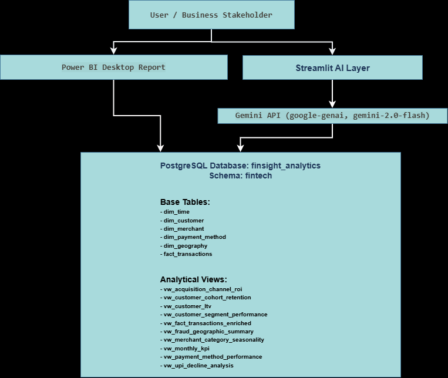
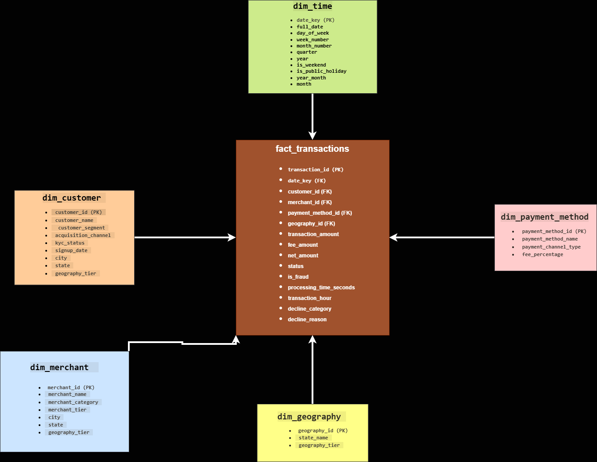

# FinSight
### Fintech Transaction Analytics Warehouse with Natural Language BI

FinSight is an end-to-end fintech analytics portfolio project built around an Indian digital payments business use case. It combines PostgreSQL warehouse design, analytical SQL, Power BI reporting, and an AI-assisted query interface to show how transaction data can be transformed into business insight.

This project was built to answer the kind of recurring questions a payments business would actually care about: revenue movement, payment method performance, fraud patterns, customer value, merchant contribution, geography-based trends, and failed transaction behavior.

---

## Table of Contents

- [Project Overview](#project-overview)
- [Business Problem](#business-problem)
- [Business Impact](#business-impact)
- [What This Project Does](#what-this-project-does)
- [Where This Project Runs](#where-this-project-runs)
- [Tech Stack](#tech-stack)
- [Architecture](#architecture)
- [Workflow](#workflow)
- [Process Diagram](#process-diagram)
- [Star Schema](#star-schema)
- [Analytical Views](#analytical-views)
- [SQL Analysis Layer](#sql-analysis-layer)
- [Power BI Dashboard](#power-bi-dashboard)
- [Streamlit AI Demo](#streamlit-ai-demo)
- [Demo Video](#demo-video)
- [Project Structure](#project-structure)
- [How It Works Step by Step](#how-it-works-step-by-step)
- [How to Run the Project](#how-to-run-the-project)
- [Privacy and Security](#privacy-and-security)
- [Outputs](#outputs)
- [Supporting Documents](#supporting-documents)
- [Future Improvements](#future-improvements)
- [License](#license)
- [Beginner Notes for Adding Links and Images](#beginner-notes-for-adding-links-and-images)

---

## Project Overview

FinSight is a portfolio project designed to simulate a realistic fintech transaction analytics environment.

The project uses a warehouse-style data model in PostgreSQL, supported by business-oriented SQL views, Power BI dashboards, and a Streamlit-based AI query layer. Instead of focusing only on charts or SQL scripts, the project is structured as a complete analytics workflow that connects data modeling, reporting, business reasoning, and AI-assisted analysis.

---

## Business Problem

In digital payments, data is generated constantly, but useful answers are often slow to reach the people who need them.

A business team may want to know:

- Whether revenue is improving or weakening over time
- Which payment methods are helping growth and which are creating friction
- Whether fraud is scattered or concentrated in specific places or conditions
- Which customer segments are actually valuable
- Which merchants are driving healthy volume and which ones may be weakening
- Whether failed transactions represent unavoidable loss or recoverable opportunity

Without a structured analytics system, these answers often depend on repeated manual analysis, disconnected files, and slow reporting loops.

---

## Business Impact

FinSight was designed to reduce that reporting friction.

It brings important business questions into one repeatable system so that the same warehouse can support executive reporting, operational analysis, decline diagnosis, fraud investigation, customer analysis, and merchant review.

From a portfolio perspective, this project is meant to show more than tool usage. It is meant to show business thinking: how data can be structured so decisions become easier, faster, and more consistent.

---

## What This Project Does

FinSight brings together multiple layers of an analytics workflow:

- A PostgreSQL warehouse using the `fintech` schema
- A star-schema model for transaction analytics
- Analytical SQL views for repeated business questions
- A Power BI reporting layer with multi-page dashboards
- A Streamlit + Gemini interface for natural language analytics exploration
- Supporting documentation for insights, limitations, and performance verification

The strongest differentiator in the project is **decline intelligence**, using `decline_category` and `decline_reason` to separate failed transaction behavior into more meaningful business signals.

---

## Where This Project Runs

This project runs in a local analytics environment.

### Main runtime components

- PostgreSQL database: `finsight_analytics`
- Schema: `fintech`
- SQL development and verification: pgAdmin
- Notebook environment: JupyterLab
- Dashboard layer: Power BI Desktop
- AI layer: Streamlit app in `ai-layer/app.py`
- Natural language model: Google Gemini

This project does **not** use Neon.

---

## Tech Stack

### Data and warehouse
- PostgreSQL
- pgAdmin
- SQL

### Data generation and analysis
- Python
- JupyterLab
- Faker

### Reporting and BI
- Power BI Desktop

### AI layer
- Streamlit
- Google Gemini API
- `google-genai`
- `python-dotenv`

### Documentation and versioning
- Markdown
- Git
- GitHub

---

## Architecture

FinSight is structured as a layered analytics project:

1. Data is stored in PostgreSQL in the `finsight_analytics` database under the `fintech` schema.
2. Core dimension and fact tables support warehouse-style analytics.
3. SQL views provide reusable business logic for repeated analysis.
4. Power BI connects to the warehouse for dashboard reporting.
5. Streamlit provides an AI-assisted query interface.
6. Gemini helps interpret business questions and support natural language interaction.

### Architecture diagram



---

## Workflow

The workflow of the project is one of its most important parts because FinSight is not just a set of disconnected files.

### High-level workflow

1. Generate synthetic fintech data in Python
2. Create warehouse tables in PostgreSQL
3. Load and validate the transaction data
4. Build SQL views for repeated business analysis
5. Write analytical SQL queries for key business questions
6. Connect the warehouse to Power BI
7. Build the multi-page dashboard
8. Add a Streamlit-based AI query layer
9. Document insights, limitations, and performance evidence
10. Package the project for GitHub and portfolio presentation

---

## Process Diagram

The business process behind the project can be understood like this:

Business questions  
→ transaction warehouse design  
→ PostgreSQL tables  
→ SQL views  
→ SQL analysis + Power BI dashboard + AI query layer  
→ business insights

If you create a dedicated workflow or process image later, place it in `docs/` and link it here.

---

## Star Schema

FinSight uses a star-schema structure to support reporting and analysis.

### Core warehouse tables

#### Dimension tables
- `fintech.dim_time`
- `fintech.dim_customer`
- `fintech.dim_merchant`
- `fintech.dim_payment_method`
- `fintech.dim_geography`

#### Fact table
- `fintech.fact_transactions`

### Important fact table fields

- `transaction_id`
- `date_key`
- `customer_id`
- `merchant_id`
- `payment_method_id`
- `geography_id`
- `transaction_amount`
- `fee_amount`
- `net_amount`
- `status`
- `is_fraud`
- `processing_time_seconds`
- `transaction_hour`
- `decline_category`
- `decline_reason`

### Star schema diagram



---

## Analytical Views

The analytical views are stored in the `schema/views/` folder and are used to support repeated business analysis.

### View files

- `vw_acquisition_channel_roi.sql`
- `vw_customer_cohort_retention.sql`
- `vw_customer_ltv.sql`
- `vw_customer_segment_performance.sql`
- `vw_fact_transactions_enriched.sql`
- `vw_fraud_geographic_summary.sql`
- `vw_merchant_category_seasonality.sql`
- `vw_monthly_kpi.sql`
- `vw_payment_method_performance.sql`
- `vw_upi_decline_analysis.sql`

These views were created to make business analysis faster, cleaner, and easier to reuse across SQL and Power BI.

---

## SQL Analysis Layer

The project also includes a dedicated SQL analysis layer in `sql/queries/`, with 17 business-focused query files.

### Query files

- `01_monthly_revenue_trend.sql`
- `02_payment_method_performance.sql`
- `03_fraud_analysis_by_geography.sql`
- `04_top_merchants_by_revenue.sql`
- `05_customer_segment_revenue_contribution.sql`
- `06_monthly_active_customers.sql`
- `07_payment_method_market_share_trend.sql`
- `08_merchant_churn_identification.sql`
- `09_revenue_leakage_analysis.sql`
- `10_peak_hour_fraud_analysis.sql`
- `11_customer_lifetime_value.sql`
- `12_period_over_period_growth.sql`
- `13_customer_cohort_retention.sql`
- `14_high_value_transaction_risk_profile.sql`
- `15_merchant_category_seasonality.sql`
- `16_acquisition_channel_comparative_roi.sql`
- `17_upi_decline_technical_vs_business.sql`

These queries were written to answer the main business questions behind the project.

---

## Power BI Dashboard

The Power BI layer was created as a multi-page business reporting solution.

### Dashboard pages

#### 1. Executive Overview
- KPI cards
- Revenue trend
- Payment method mix
- Geography analysis
- Top merchants

#### 2. Customer and Segment Analytics
- Customer segment contribution
- Acquisition channel performance
- Customer value analysis
- Retention-oriented analysis

#### 3. Risk, Fraud, and Decline Intelligence
- Fraud trend
- Geography-based fraud concentration
- Failed transaction analysis
- Decline category analysis
- Decline reason analysis
- Technical vs business decline thinking

#### 4. Merchant and Operations Analytics
- Merchant tier performance
- Merchant category patterns
- Seasonality analysis
- Operational transaction behavior

### Dashboard screenshots

Add your Power BI screenshots here once the image files are saved inside the repository.

Example image file names:
- `docs/powerbi-executive-overview.png`
- `docs/powerbi-customer-segment.png`
- `docs/powerbi-risk-fraud-decline.png`
- `docs/powerbi-merchant-operations.png`

---

## Streamlit AI Demo

FinSight also includes a Streamlit-based natural language BI prototype that was designed to let users ask business questions in plain language and support SQL-assisted analytics.

A Streamlit-based natural language BI interface was developed for this project.  
Screenshots are included below to demonstrate the workflow and interface.

This app is currently presented as a local prototype rather than a public deployment because it depends on secure credentials and a local PostgreSQL workflow.

### What this layer demonstrates

- Natural language business questioning
- SQL generation support
- Query validation thinking
- Business-friendly answer presentation

### App file

- `ai-layer/app.py`

### Showcase approach

This app is showcased through:
- local implementation in the repository
- documentation in this README
- screenshots stored in `docs/`
- video walkthrough support

Add Streamlit screenshots here only if these files actually exist:
- `docs/streamlit-home.png`
- `docs/streamlit-query-input.png`
- `docs/streamlit-sql-output.png`
- `docs/streamlit-results.png`

---

## Demo Video

A walkthrough video for the project is available here:

[Watch the FinSight demo video](https://www.loom.com/share/5cbcb307638a4ce9aa88fdd5a186f662)

This video is the fastest way to understand the dashboard flow and the project story.

---

## Project Structure

```text
finsight-fintech-analytics/
│
├── ai-layer/
│   └── app.py
│
├── docs/
│   ├── datadictionary.md
│   ├── indexperformanceevidence.txt
│   ├── powerbilivelink.txt
│   ├── starschemadiagram.png
│   ├── story.md
│   └── streamlitlivelink.txt
│
├── insights/
│   └── insightsreport.md
│
├── limitations/
│   └── limitations.md
│
├── notebooks/
│   └── datageneration.ipynb
│
├── power-bi/
│   ├── FinSight.pbix
│   └── FinSight_PowerBI_Report.pdf
│
├── schema/
│   ├── tables/
│   │   ├── dim_customer.sql
│   │   ├── dim_geography.sql
│   │   ├── dim_merchant.sql
│   │   ├── dim_payment_method.sql
│   │   ├── dim_time.sql
│   │   └── fact_transactions.sql
│   │
│   └── views/
│       ├── vw_acquisition_channel_roi.sql
│       ├── vw_customer_cohort_retention.sql
│       ├── vw_customer_ltv.sql
│       ├── vw_customer_segment_performance.sql
│       ├── vw_fact_transactions_enriched.sql
│       ├── vw_fraud_geographic_summary.sql
│       ├── vw_merchant_category_seasonality.sql
│       ├── vw_monthly_kpi.sql
│       ├── vw_payment_method_performance.sql
│       └── vw_upi_decline_analysis.sql
│
├── sql/
│   └── queries/
│       ├── 01_monthly_revenue_trend.sql
│       ├── 02_payment_method_performance.sql
│       ├── 03_fraud_analysis_by_geography.sql
│       ├── 04_top_merchants_by_revenue.sql
│       ├── 05_customer_segment_revenue_contribution.sql
│       ├── 06_monthly_active_customers.sql
│       ├── 07_payment_method_market_share_trend.sql
│       ├── 08_merchant_churn_identification.sql
│       ├── 09_revenue_leakage_analysis.sql
│       ├── 10_peak_hour_fraud_analysis.sql
│       ├── 11_customer_lifetime_value.sql
│       ├── 12_period_over_period_growth.sql
│       ├── 13_customer_cohort_retention.sql
│       ├── 14_high_value_transaction_risk_profile.sql
│       ├── 15_merchant_category_seasonality.sql
│       ├── 16_acquisition_channel_comparative_roi.sql
│       └── 17_upi_decline_technical_vs_business.sql
│
├── .env.example
├── .gitignore
├── README.md
├── requirements.txt
└── LICENSE
```

---

## How It Works Step by Step

### Step 1: Data modeling
The project starts by designing a fintech star schema around transaction analytics.

### Step 2: Data generation
Synthetic but business-shaped data is generated in Python to reflect realistic payment patterns.

### Step 3: Table creation
Warehouse tables are created inside the `fintech` schema in PostgreSQL.

### Step 4: Data loading and validation
The data is loaded into the tables and checked for consistency.

### Step 5: View creation
SQL views are built to support repeated business questions.

### Step 6: SQL analysis
Seventeen analytical SQL files are used to answer core business questions across revenue, fraud, customer behavior, merchant performance, and decline analysis.

### Step 7: Power BI reporting
Power BI connects to PostgreSQL and turns the model into a multi-page reporting dashboard.

### Step 8: AI-assisted querying
A Streamlit app provides a natural language interface for asking business questions.

### Step 9: Documentation and packaging
The project is supported by diagrams, story, insights, limitations, and performance evidence so that the work is portfolio-ready and easier to understand.

---

## How to Run the Project

### 1. Clone the repository

```bash
git clone <your-repository-url>
cd finsight-fintech-analytics
```

### 2. Create a virtual environment

```bash
python -m venv venv
```

### 3. Activate the environment

**Windows**
```bash
venv\Scripts\activate
```

**Mac/Linux**
```bash
source venv/bin/activate
```

### 4. Install dependencies

```bash
pip install -r requirements.txt
```

### 5. Configure environment variables

Create a `.env` file in the project root and add:

```env
DATABASE_URL_LOCAL=your_postgresql_connection_string
GEMINI_API_KEY=your_gemini_api_key
```

Do not hardcode credentials into source files.

### 6. Create the warehouse tables

Run the SQL files in `schema/tables/`.

### 7. Create the analytical views

Run the SQL files in `schema/views/`.

### 8. Review the SQL analysis files

Open and run the query files from `sql/queries/` as needed.

### 9. Open the dashboard

Open the Power BI file in the `power-bi/` folder.

### 10. Run the AI layer

```bash
streamlit run ai-layer/app.py
```

---

## Privacy and Security

This project uses synthetic data and is intended for learning, demonstration, and portfolio use.

Important practices followed:

- Credentials should be stored in `.env`
- `.env.example` should show variable names only, never real secrets
- No passwords or API keys should be committed to GitHub
- The AI layer should be treated carefully because generated SQL and API usage require validation
- Public repositories should never contain live credentials

---

## Outputs

This project produces the following outputs:

- PostgreSQL warehouse tables
- SQL views
- Analytical SQL query files
- Star schema diagram
- Architecture diagram
- Power BI report
- Power BI PDF export
- AI-assisted query interface
- Demo video
- Insights report
- Limitations document
- Data dictionary
- Index performance evidence

---

## Supporting Documents

- [Project story](docs/story.md)
- [Data dictionary](docs/datadictionary.md)
- [Insights report](insights/insightsreport.md)
- [Limitations](limitations/limitations.md)
- [Index performance evidence](docs/indexperformanceevidence.txt)

You can also keep project links in:
- `docs/powerbilivelink.txt`
- `docs/streamlitlivelink.txt`

GitHub recommends using relative paths for repository files and images, which is the same approach used in this README. [web:106][web:111][web:160]

---

## Future Improvements

Possible future improvements for FinSight include:

- Adding a dedicated workflow diagram image
- Adding Power BI screenshots as image files in the repository
- Strengthening SQL validation in the AI layer
- Improving prompt handling and guardrails in the natural language interface
- Expanding performance testing with larger data volumes
- Adding deeper Power BI measure documentation
- Publishing a hosted version of the Streamlit interface

---

## License

This project is licensed under the MIT License. See the [LICENSE](LICENSE) file for details.

---

## Beginner Notes for Adding Links and Images

As a beginner, use these simple rules:

### 1. How to add an internal file link

If the file is inside your repository, use a relative path.

Example:

```md
[Project story](docs/story.md)
```

### 2. How to add an image

If an image file is saved in `docs/`, use:

```md

```

### 3. How to add a video link

For a Loom link, use:

```md
[Watch the FinSight demo video](https://www.loom.com/share/5cbcb307638a4ce9aa88fdd5a186f662)
```

### 4. Where to keep screenshots

Save your Power BI screenshots inside `docs/` with clean names like:

- `powerbi-executive-overview.png`
- `powerbi-customer-segment.png`
- `powerbi-risk-fraud-decline.png`
- `powerbi-merchant-operations.png`

Then add them in the README using:

```md

```

### 5. Where to keep links

For text links you want to save in the repo, use small `.txt` files in `docs/`, such as:

- `docs/powerbilivelink.txt`
- `docs/streamlitlivelink.txt`

### 6. How to avoid mistakes

Before pushing to GitHub:

- Check that every file name matches exactly
- Check that every image path opens correctly
- Check that every markdown link works
- Do not leave placeholders if the actual file is ready
- Do not commit `.env`

---

## Final Note

FinSight was built as a portfolio project to show how warehouse design, analytical SQL, BI reporting, and AI-assisted analytics can come together in one structured fintech use case.

The goal of this project is not just to show tools. It is to show analytical thinking, business understanding, and the ability to build a complete data project that feels realistic, organized, and interview-ready.